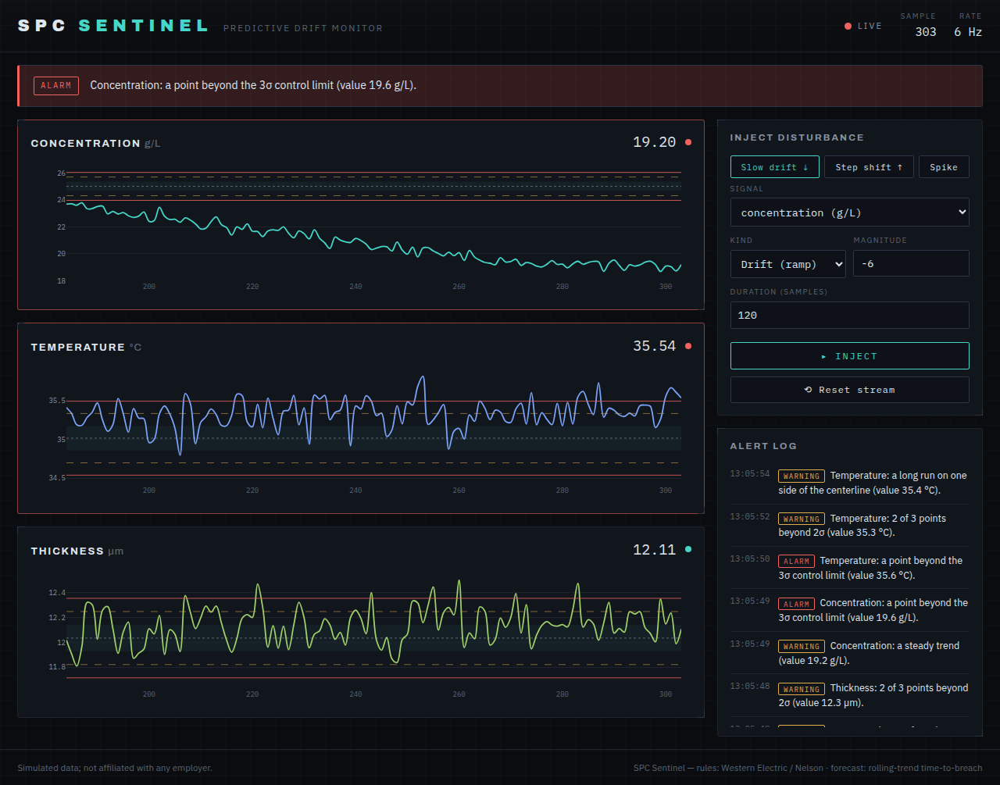

# SPC Sentinel

A live statistical-process-control dashboard that predicts when a process will drift out of spec **before** it does — built so a 2 a.m. operator will actually trust and act on the alert.

**▶ Live demo: <https://spc.hector-garza.com/>** — click *Inject → Slow drift ↓* and watch it forecast the breach.

> **Illustrative tool on synthetic data — not affiliated with any employer.**



Part of [hector-garza.com](https://hector-garza.com)'s portfolio. This repo is one of **three equal deliverables**: the app, a **Decision Record** ([`DECISIONS.md`](./DECISIONS.md)), and a recorded whiteboard session. A working demo no longer proves competence — the judgment behind it does. See [`SPEC.md`](./SPEC.md) §0.

## What it does
- Streams seeded **synthetic** process telemetry — bath concentration (g/L), bath temperature (°C), deposition thickness (µm) — each with computed control limits.
- Flags **Western Electric / Nelson** rule violations (point beyond 3σ, 9-in-a-row, 6-point trend, 2-of-3 beyond 2σ).
- Forecasts a short-horizon **time-to-breach** (rolling linear trend) and warns *before* the limit is crossed.
- **Plain-English alerts** an operator can act on — *"Concentration trending down — projected to fall below 18.0 g/L in ~22 min. Likely cause: drag-out depletion. Recommend a chemistry addition."*
- An **inject-drift** control (drift / step / spike on any signal) to demo it live, plus a reset.

## The judgment (why this is built the way it is)
The hard part isn't detection — it's being *trusted*. Two decisions carry the project (full reasoning in [`DECISIONS.md`](./DECISIONS.md)):

- **Explainable over accurate.** The detector is deterministic SPC rules + a readable trend slope, not a black-box anomaly model. An operator won't act on an alert they can't trace to a cause, so a model that's a few % more accurate but unexplainable is *worse* on the floor.
- **Tuned against alert fatigue.** The real failure is crying wolf: too many false alarms and operators mute the system, so a true drift gets ignored. Forecast alerts fire only when the trend is statistically significant (a ~3σ slope t-test — the one tunable sensitivity knob), and alerts are edge-triggered so a persistent condition fires once at onset, not every sample.

## Tech stack
- **Backend:** Django + Channels (ASGI), served by daphne. One shared in-process engine, streamed over a WebSocket to all clients.
- **SPC engine:** pure, framework-free, test-first — NumPy / pandas / SciPy. *(No scikit-learn: the model is a deliberately transparent rolling trend, not a learned black box — that restraint is the point.)*
- **Frontend:** Django template + Plotly + vanilla JS over the WebSocket (no SPA — the substance is the engine).
- **Packaging:** Docker · **Quality:** pytest + ruff + GitHub Actions CI.

## Run it locally
One command (serves at <http://localhost:8000>):
```bash
make run          # == docker compose up --build
```

Or without Docker:
```bash
python -m venv .venv && . .venv/bin/activate
pip install -r requirements-dev.txt
daphne -b 127.0.0.1 -p 8000 config.asgi:application
```

### Tests & lint
```bash
pytest            # full suite (pure SPC engine, generator, forecaster, backend, alerts)
ruff check . && ruff format --check .
```

### Configuration (env)
| Variable | Default | Purpose |
|---|---|---|
| `DJANGO_DEBUG` | `0` | Django debug mode |
| `DJANGO_ALLOWED_HOSTS` | `*` | comma-separated allowed hosts |
| `DJANGO_SECRET_KEY` | dev fallback | **set in production** |
| `DJANGO_CSRF_TRUSTED_ORIGINS` | _(empty)_ | comma-separated `https://…` origins |
| `SPC_SAMPLE_RATE_HZ` | `1.0` | telemetry samples per second |
| `SPC_WARMUP` | `20` | in-control samples before limits/alerts |

## Architecture
```
Browser (Plotly + vanilla JS)
   ▲ WebSocket  {t, samples, limits, alerts}      │ REST  POST /api/inject · /api/reset · GET /api/config
   │                                              ▼
Django + Channels (ASGI, daphne)
   • one producer task steps a shared Engine at the sample rate, broadcasts to a group
   • Engine: seeded generator → frozen warm-up control limits → WE/Nelson rules
             + rolling-trend forecaster → plain-English alert builder
```
Pure logic lives in `sentinel/spc/` (`limits.py`, `rules.py`, `forecast.py`) and `sentinel/sim/generator.py`; the framework layer is `sentinel/engine.py`, `consumers.py`, `views.py`.

## Deployment
Dockerized; honors `$PORT` and runs as a non-root user. A [`render.yaml`](./render.yaml) blueprint is included.
- **Render:** Dashboard → New → Blueprint → this repo. Keep it a **single instance** (the in-memory channel layer is single-process — a deliberate non-goal to add Redis for a demo).
- Front with **Cloudflare** and point `spc.hector-garza.com` at the Render service; add that host to `DJANGO_ALLOWED_HOSTS` / `DJANGO_CSRF_TRUSTED_ORIGINS`.
- WebSocket: the client auto-selects `wss://` under HTTPS; `SECURE_PROXY_SSL_HEADER` is set so Django trusts the proxy's forwarded-proto.

## Links
- 🔗 Live demo: <https://spc.hector-garza.com/> (Dockerized Django on Render, fronted by Cloudflare)
- 🧠 Decision record: [`DECISIONS.md`](./DECISIONS.md) — the four questions, the rejected option, the accepted risk
- 🎥 Whiteboard walkthrough: _TBD (recording guide: [`WHITEBOARD-SCRIPT.md`](./WHITEBOARD-SCRIPT.md))_

## Build
See [`PLAN.md`](./PLAN.md) — milestones M0 (scaffold) → M7 (decision record + whiteboard).
